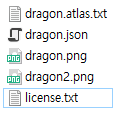

# SpineUnityOnCommand

- ### You can load skeleton at runtime, very easly.  
   The sorce from spine-runtimes(https://github.com/EsotericSoftware/spine-runtimes) load process.  
   Tested at **Unity 2019.4.10f1 URP**, **Spine 4.0**, **Android OS**.  
   This code follows [**EsotericSoftware/spine-runtimes**'s license](https://github.com/EsotericSoftware/spine-runtimes/blob/4.0/LICENSE).

- ### How to.
   1> If you don't have any spine files. [Get a one.](https://github.com/EsotericSoftware/spine-runtimes/tree/4.0/spine-unity/Assets/Spine%20Examples/Spine%20Skeletons/Dragon)  
   2> Ready the folder as default state that you export spine.   
   　　and memorize the path.  
   3> Import spine-unity packages.  
   4> Import this repository.

- ### Etc.  
   If you can read Korean. Check it out.  
   [more..](https://blog.naver.com/dusdkel/222536645274)
